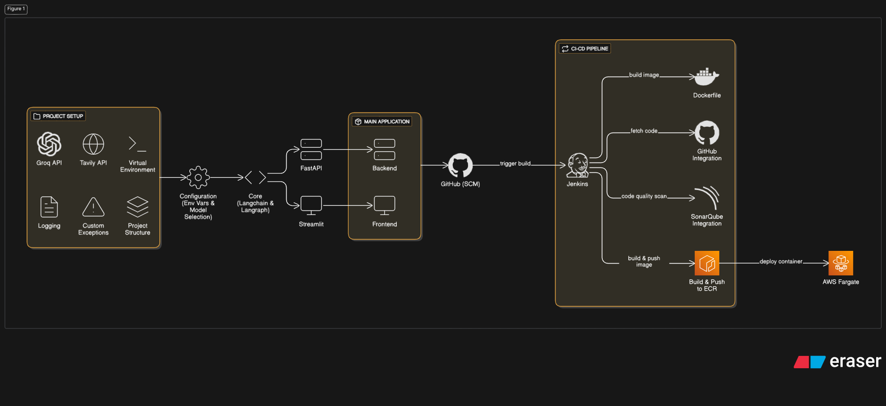

# Multi AI Agent: Intelligent Multi-Agent Orchestration System


[](https://github.com/HamzaImtiaz03/MULTI-AI-AGENT)
[](https://opensource.org/licenses/MIT)
[](https://www.python.org/)
[](https://www.docker.com/)
[](https://aws.amazon.com/)

## Overview

The **Multi AI Agent** is a sophisticated, scalable system leveraging multiple AI agents to handle complex tasks through orchestration, reasoning, and external tool integration. Built on cutting-edge frameworks like LangGraph and LangChain, it combines fast inference from Groq, intelligent search via Tavily, and seamless workflows to deliver dynamic, context-aware solutions.

This project exemplifies modern AI engineering, featuring a modular architecture with a Streamlit frontend for intuitive user interaction, a FastAPI backend for robust API handling, and an automated CI/CD pipeline ensuring code quality and rapid deployment. Ideal for developers, researchers, and enterprises exploring multi-agent systems for automation, decision-making, or advanced AI applications.

## Key Features

- **Multi-Agent Orchestration**: Utilizes LangGraph for graph-based workflows and LangChain for chainable agent logic, enabling collaborative task resolution.
- **High-Performance Inference**: Integrates Groq API for ultra-fast LLM processing and Tavily API for real-time search and data retrieval.
- **Dual-Layer Application**: Streamlit frontend for interactive UI (port 8501) and FastAPI backend for API endpoints (port 9999).
- **Environment Configuration**: Secure handling of API keys and variables via `.env` files and Docker.
- **Code Quality & Security**: SonarQube integration for static code analysis and vulnerability detection.
- **Automated CI/CD**: Jenkins pipeline for cloning, building, scanning, pushing to AWS ECR, and deploying to AWS ECS Fargate.
- **Containerization & Scalability**: Dockerized for portability, with AWS Fargate for serverless, auto-scaling deployment.
- **Cross-Platform Compatibility**: Supports WSL on Windows for development and testing.

## Architecture

The system follows a streamlined, end-to-end architecture as depicted in the flowchart below:

 <!-- Replace with actual image URL or embed -->

### High-Level Breakdown:
1. **Project Setup**: Groq/Tavily API integration, virtual environment, custom exceptions, logging, and project structure.
2. **Main Application**: Core logic with LangChain & LangGraph, FastAPI backend for API services, and Streamlit frontend for user-facing interactions.
3. **CI/CD Pipeline**: GitHub SCM triggers Jenkins builds, SonarQube scans for code quality, Docker image creation and push to AWS ECR, followed by deployment to AWS ECS Fargate.

This design prioritizes modularity, efficiency, and reliability, making it easy to extend with new agents or tools.

## Technologies Used

- **AI/ML Frameworks**: LangGraph (graph orchestration), LangChain (agent chains), LangChain-Groq (inference), LangChain-Community (extensions).
- **APIs & Tools**: Groq (LLM inference), Tavily (search API).
- **Backend**: FastAPI (API framework), Uvicorn (ASGI server), Pydantic (data validation).
- **Frontend**: Streamlit (interactive web apps).
- **Environment & Utilities**: Python-dotenv (secrets management), Python 3.10.
- **DevOps & Deployment**: Docker (containerization), Jenkins (CI/CD), SonarQube (code analysis), AWS (ECR for registry, ECS Fargate for hosting).
- **Version Control**: GitHub.

Full dependencies are listed in `requirements.txt`.

## Installation

### Prerequisites
- Python 3.10+
- Git
- Docker (for containerization)
- AWS Account (for deployment)
- API Keys: Groq and Tavily (stored in `.env`)

### Steps
1. **Clone the Repository**:
   ```
   git clone https://github.com/HamzaImtiaz03/MULTI-AI-AGENT.git
   cd MULTI-AI-AGENT
   ```

2. **Set Up Virtual Environment** (Recommended):
   ```
   python -m venv venv
   source venv/bin/activate  # On Unix/Mac/WSL
   # Or on Windows: venv\Scripts\activate
   ```

3. **Install Dependencies**:
   ```
   pip install -e .
   ```

4. **Configure Environment Variables**:
   Create a `.env` file in the root directory:
   ```
   GROQ_API_KEY=your_groq_api_key
   TAVILY_API_KEY=your_tavily_api_key
   # Add other variables as needed (e.g., AWS credentials for deployment)
   ```

## Usage

1. **Run the Application Locally**:
   ```
   python app/main.py
   ```
   - Access the Streamlit frontend at `http://localhost:8501`.
   - Interact with the multi-agent system by submitting tasks or queries.
   - The FastAPI backend is available at `http://localhost:9999` for API calls.

2. **Example Interactions**:
   - Query: "Analyze market trends for AI agents."
     - Agents collaborate: Search via Tavily, process with Groq, and respond via Streamlit.
   - Extend functionality by adding custom agents in LangGraph configurations.

3. **Customization**:
   - Modify agent workflows in LangGraph/LangChain modules.
   - Integrate additional APIs or tools as needed.

## Deployment

This project features a fully automated CI/CD pipeline for deployment to AWS ECS Fargate.

### Prerequisites
- Jenkins setup (as detailed in `FULL_DOCUMENTATION.md`).
- AWS IAM user with ECR and ECS permissions.
- SonarQube server for code analysis.
- GitHub Personal Access Token.

### Pipeline Overview (via Jenkinsfile)
1. **Clone Repo**: Pulls from GitHub using credentials.
2. **SonarQube Analysis**: Scans code for quality and vulnerabilities.
3. **Build & Push Docker Image**: Uses `Dockerfile` to build, tag, and push to AWS ECR.
4. **Deploy to ECS Fargate**: Updates the ECS service with the new image, forcing a redeployment.

### Manual Deployment Steps
- Follow `FULL_DOCUMENTATION.md` for WSL, Docker, Jenkins, SonarQube, and AWS setup.
- Build and push Docker image:
  ```
  docker build -t multi-ai-agent .
  ```
- Deploy to AWS ECS Fargate via console or CLI, using the task definition and service configurations.

Once deployed, access the live app via the ECS public IP on port 8501 (Streamlit) or 9999 (FastAPI).

## Contributing

Contributions are encouraged! To participate:
1. Fork the repository.
2. Create a feature branch (`git checkout -b feature/YourFeature`).
3. Commit changes (`git commit -m 'Add YourFeature'`).
4. Push to the branch (`git push origin feature/YourFeature`).
5. Open a Pull Request.

Adhere to best practices, including code quality checks via SonarQube.

## License

This project is licensed under the MIT License - see the [LICENSE](LICENSE) file for details.

## Acknowledgments

- Frameworks: LangChain, LangGraph, Groq, Tavily.
- Tools: FastAPI, Streamlit, Jenkins, SonarQube, Docker, AWS.
- Inspired by advancements in multi-agent AI systems for collaborative intelligence.

For inquiries or collaboration, open an issue on GitHub or contact [Hamza Imtiaz](mailto:your.email@example.com).

---

*Built by Hamza Imtiaz | Revolutionizing AI Collaboration*